# Project III

Implementation of a program to interface with the MPU-6050 accelerometer and TCS34725 color sensor using I2C communication in Embedded Linux generated with Buildroot. The data is sent from the Raspberry Pi to the Ubuntu VM using UDP. Also, the data is published in ThingsBoard using MQTT.

## MPU-6050 information
- **VCC**: 2.375V - 3.46V.
- **I2C**: SDA (Pin 24) and SCL (Pin 23). 
- **Wake up** and **Sleep mode**: Register 107 (0x6B): PWR_MGMT_1 → SLEEP (Bit 6) = 1.
- **Sample rate**: Register 25 (0x19) → For the accelerometer, the output sample rate is **1kHz** (1ms).
- **X, Y and Z values**: Registers 59 to 64 → 16-bit 2’s complement values.

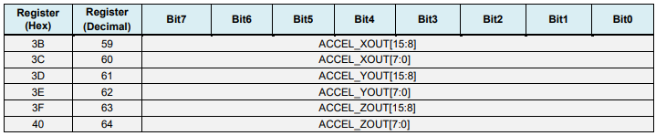

- **Full scale range and Sensitivity per LSB**: Register 28 (0x1C) → **AFS_SEL[1:0]** (Bit 4 and 3). In this program, it is 16384 LSB/g.


### I2C modes

**I2C Terms**:

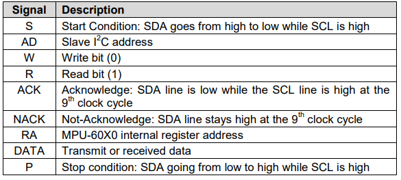

**Write Sequence**:
- **Single-Byte**: Used in this program.

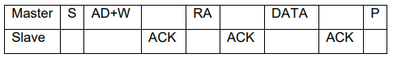

- **Burst**:

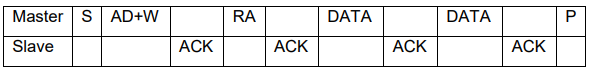

**Read Sequence**:
- **Single-Byte**:

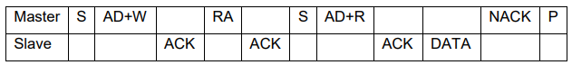

- **Burst**: Used in this program.

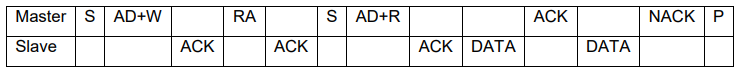


## TCS3472 information
- **VCC**: 2.7V - 3.6V.
- **I2C**: SDA (Pin 6) and SCL (Pin 2). 
- **System states**: Start condition I2C when is sleeping → Checks the Enable Register  PON bit (0x00, b0) → Remains in the Idle state until the RGBC function is enabled (AEN) → Wait and RGBC sequence.

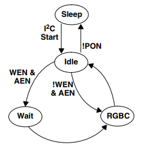

- **RGBC Operation**: 
	- **AGAIN**: 0x01 - RGBC gain control. 
		- Amplifies the analog signal for low-light conditions.
		- 1x, 4x, 16x, 60x.
	- **ATIME**: 0x0F, b1:0 - RGBC integration time. 
		- Longer times increase sensitivity but reduce sampling speed.
		- 2.4ms to 614ms (2’s compliment values).


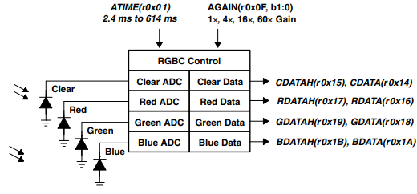

### I2C Protocol

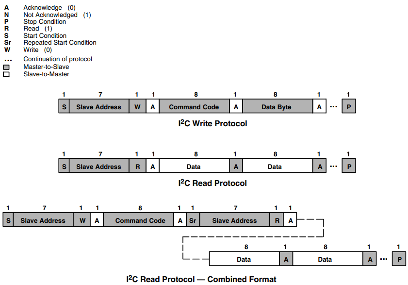


# Set up the Raspberry Pi
### Buildroot

In addition to the [builroot configuration](https://mruizglz.github.io/rpi-buildroot-lab/rpi-tutorial.html), add:
- `Target packages → Hardware handling → i2c-tools`
- `Target packages → Text editors and viewers → nano`
- `Target packages → Networking applications → udpcast`
- `Target packages → Networking applications → mosquitto`
- `Target packages → Debugging, profiling and benchmark → valgrind`

### Connection via SSH

Its necessary to change the parameter `PermitRootLogin` in `etc/ssh/sshd_config`:
- From:
```
#PermitRootLogin prohibit-password
```

- To:
```
PermitRootLogin yes
```

### Pin connections

|     | **Color sensor** | **Accelerometer** | **RPI** |
| :-: | :--------------: | :---------------: | :-----: |
| VCC |        1         |        3V3        |    1    |
| GND |        3         |      Ground       |    9    |
| SDA |        6         |       GPIO2       |    3    |
| SCL |        2         |       GPIO3       |    5    |

### I2C configuration

First, in `config.txt`, add the following line:
```
dtparam=i2c_arm=on
```

Next, activate i2c kernel modules. For a automatic activation in the booting, create the file `/etc/init.d/S30i2cmods`:
```
#!/bin/sh
modprobe i2c-bcm2835
sleep 1
modprobe i2c-dev
exit 0
```

Check the activation with:
```
lsmod | grep i2c
```


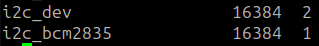

Finally, run the following command to detect the accelerometer and the color sensor:
```
i2cdetect -l
i2cdetect -y 1
```


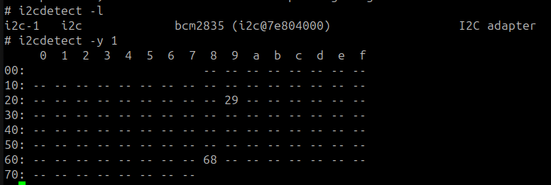

## Compilation and execution
In a Terminal window execute the following commands:

```
# change the directory to the folder where `build` directory is
$ cd build/host
$ source environment-setup
# run eclipse in the same terminal. In this case eclipse is available in your ubuntu user folder
$ /home/ubuntu/eclipse/embedcpp-2024-09/eclipse/eclipse &
```

In Eclipse select in the left part of the windows Import projects. Select 
- `C/C++`
- `Existing Code as Makefile Project`
- `Cross GCC in Toolchain for Indexer Settings`

For compile the code, it’s needed a **Makefile**:
```
LIBS= -lmosquitto -lpthread -lm #Libraries used if needed
SRCS= main.cpp Accelerometer/accelerometer.cpp Color_Sensor/color_sensor.cpp UDP_Client/udp_client.cpp MQTT_Client/mqtt_client.cpp
BIN=project_III
CFLAGS+= -g -O0
OBJS=$(subst .cpp,.o,$(SRCS))

all : $(BIN)

$(BIN): $(OBJS)
    @echo [link] $@
    $(CXX) -o $@ $(OBJS) $(LDFLAGS) $(LIBS)

%.o: %.cpp
    @echo [Compile] $<
    $(CXX) -c $(CFLAGS) $< -o $@

clean:
    @rm -f $(OBJS) $(BIN)
```

For cross-compile and link the program in eclipse: `Project → Build project`. Now, copy the executable `project_III` in the RPI, using Nautilus:

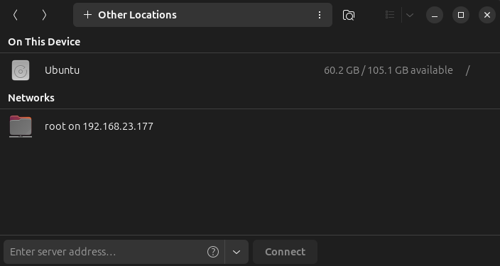

Finally, to execute the program in the RPI, execute the next command:
```
project_III
```


### UDP Server

In the vm → UDP_Server folder:
```
gcc main.cpp udp_server.cpp -o udp_server
udp_server
```

### ThingsBoard

Run ThingsBoard in localhost:8080 on the VM:
```
sudo service thingsboard start
```

There are used two devices:

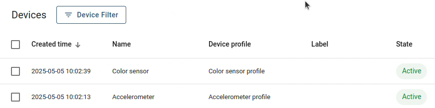

Example of the telemetry received:

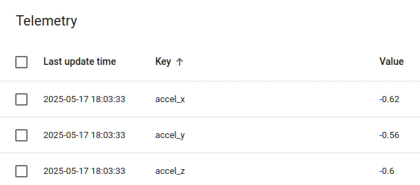

And the dashboard:

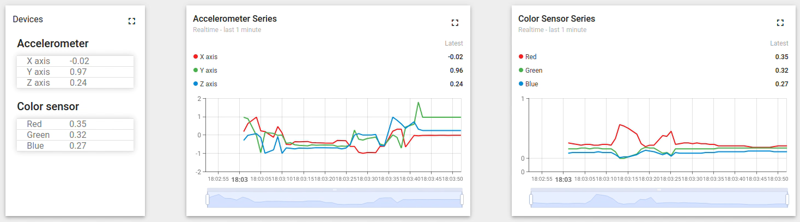

## CppCheck
```
sudo apt install cppcheck
cppcheck --enable=all --inconclusive --std=c++11 --force --suppress=missingIncludeSystem .
```

## Valgrind
For the UDP Server:
```
valgrind -s --leak-check=full --track-origins=yes udp_server
```


